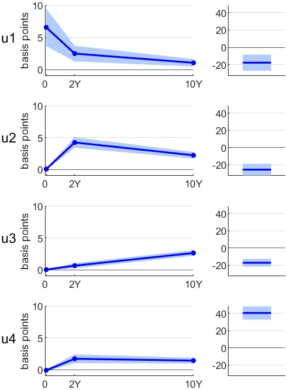

### Updating the Fed conventional and unconventional policy shocks from: Marek Jarocinski "Estimating the Fed's Unconventional Monetary Policy Shocks," Journal of Monetary Economics, [doi:10.1016/j.jmoneco.2024.01.001](https://doi.org/10.1016/j.jmoneco.2024.01.001)

#### Updated shocks (January 1991 - September 2024):
- `U1s.csv` - one standard deviation shocks
- `U1bp.csv` - shocks scaled to move the relevant variable by 1 basis point

High-frequency effects of the shocks:

#### Construction of the shocks:
- `code/main.m` - Matlab script (calls other Matlab functions). These codes were tested using Matlab R2023b.

#### Source data: 
- `source_data/fomc_surprises_jk.csv` - narrow window (30 minutes) surprises around FOMC announcements from 1988 to 2024 updated by Jarocinski and Karadi. For more information about these data see the Readme file in [https://github.com/marekjarocinski/jkshocks_update_fed](https://github.com/marekjarocinski/jkshocks_update_fed).

#### Licensing

The content of this repository is available under the usual conditions applying to the replication files of academic articles (see e.g. the AEA guidelines under https://www.aeaweb.org/journals/data/faq#license):

- The source data and final dataset are licensed under the Creative Commons Attribution 4.0 International License (CC BY 4.0). For more details, see the [CC BY 4.0 License](https://creativecommons.org/licenses/by/4.0/).

- The code in this repository is licensed under the BSD 3-Clause License. For more details, see the [BSD 3-Clause License](https://opensource.org/licenses/BSD-3-Clause).

If you use this work, please cite the following paper: Marek Jarocinski "Estimating the Fed's Unconventional Monetary Policy Shocks," Journal of Monetary Economics, [doi:10.1016/j.jmoneco.2024.01.001](https://doi.org/10.1016/j.jmoneco.2024.01.001)

Marek Jarocinski, marek.jarocinski@gmail.com
